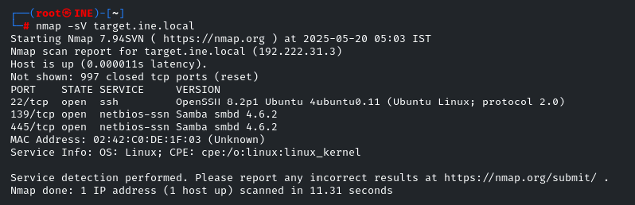
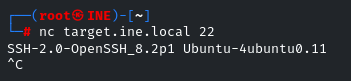
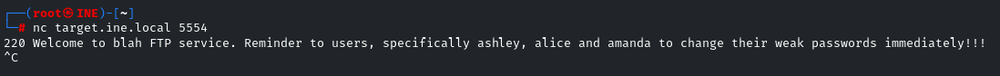
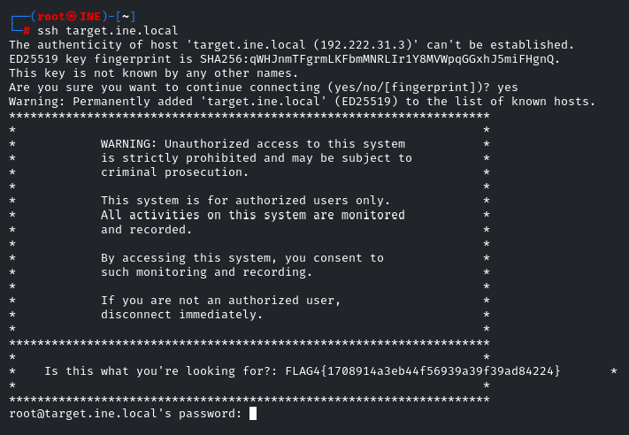

# Assessment Methodologies - ssh Banner Flag

This document contains the step-by-step walkthrough for solving **Flag 4** of the Enumeration CTF in the eJPT Assessment Methodologies lab.

> **Lab URL:**
> [https://my.ine.com/CyberSecurity/courses/d707f31c-913d-477e-951e-74503392e9ae/assessment-methodologies-enumeration/lab/24c50c27-185b-4541-a88f-e2a12811053e](https://my.ine.com/CyberSecurity/courses/d707f31c-913d-477e-951e-74503392e9ae/assessment-methodologies-enumeration/lab/24c50c27-185b-4541-a88f-e2a12811053e)

---

## 📁 Challenge Details

* **Category:** Enumeration
* **Target:** `target.ine.local`
* **Goal:** Retrieve `FLAG4` hidden during service probing and manual inspection

---

## 🔎 Step 1: Identify Open Ports with Nmap

We begin with an Nmap version scan to discover open services.

```bash
nmap -sV target.ine.local
```



This scan reveals:

* `22/tcp` - OpenSSH 8.2p1
* `139/tcp`, `445/tcp` - Samba SMB

---

## 📡 Step 2: Banner Grabbing via Netcat (SSH)

We check the SSH service for additional details:

```bash
nc target.ine.local 22
```



---

## 🛠️ Step 3: FTP Port Clue Enumeration

We interact with a previously discovered FTP port `5554` using Netcat:

```bash
nc target.ine.local 5554
```



The banner gives us this clue:

> Reminder to users, specifically ashley, alice and amanda to change their weak passwords immediately!!!

---

## 🔐 Step 4: Attempt SSH Login

With the usernames in mind, we attempt an SSH connection:

```bash
ssh target.ine.local
```



✅ During the SSH login banner, the flag is printed:

```text
FLAG4{1708914a3eb445f6993a39f39ad84224}
```

---

## 🧾 Summary

This flag was retrieved by:

1. Enumerating services using Nmap
2. Capturing the FTP banner with Netcat
3. Attempting a manual SSH connection
4. Extracting the flag embedded in the SSH login warning message

---

## 📘 Notes

* This was part of the **eJPT Assessment Methodologies** Enumeration Lab.
* All actions performed in a legal test environment.

---

**Disclaimer:**
This content is for educational use only and follows INE’s approved CTF practice environment. Unauthorized activity outside such platforms is prohibited.

---

**🔗 Return to [eJPT-CTF-Challenges Main Repository](https://github.com/sara5521/eJPT-CTF-Challenges)**
