# Vulnerability Assessment - Shellshock Exploitation Walkthrough

This document provides a step-by-step walkthrough to exploit a Shellshock vulnerability via a CGI script in the eJPT Vulnerability Assessment lab.

> **Lab URL:**
> [https://my.ine.com/CyberSecurity/courses/bf9be146-3a69-4b0e-bade-477da0002943/assessment-methodologies-vulnerability-assessment/lab/4ec0d887-3cba-3735-9b3d-b4dce91df48c](https://my.ine.com/CyberSecurity/courses/bf9be146-3a69-4b0e-bade-477da0002943/assessment-methodologies-vulnerability-assessment/lab/4ec0d887-3cba-3735-9b3d-b4dce91df48c)

---

## 📁 Challenge Details

* **Category:** Vulnerability Assessment
* **Target:** `demo.ine.local`
* **Goal:** Exploit the Shellshock vulnerability to execute remote commands and capture a flag

---

## 🧪 Step 1: Port Scan

We start with a basic port scan to identify available services.

```bash
nmap demo.ine.local
```

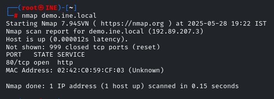

Only HTTP on port 80 is open.

---

## 🚧 Step 2: Check HTTP Page

We visit the page in the browser and discover it is an "Under Construction" site.

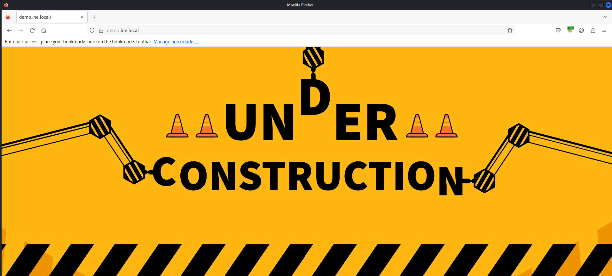

---

## 🔍 Step 3: View Page Source

Check for hidden scripts and files.

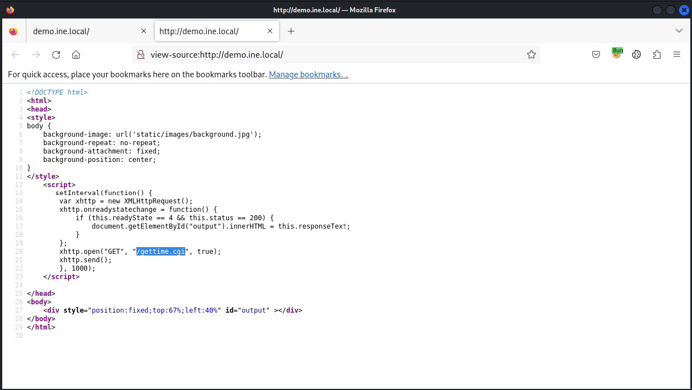

We find a reference to `/gettime.cgi` in the source code.

---

## 🔎 Step 4: Run Nmap Script for Shellshock

Use Nmap's `http-shellshock` script to test for Shellshock vulnerability.

```bash
nmap --script http-shellshock --script-args "http-shellshock.uri=/gettime.cgi" demo.ine.local
```

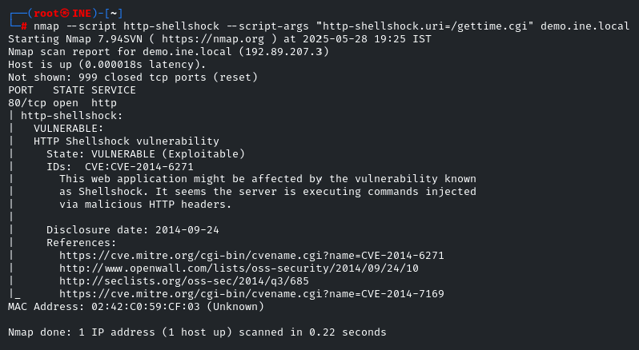

The result shows the target is vulnerable (CVE-2014-6271).

---

## 📋 Step 5: Reference Exploit Source

We reference the GitHub page for a Docker-based vulnerable environment.

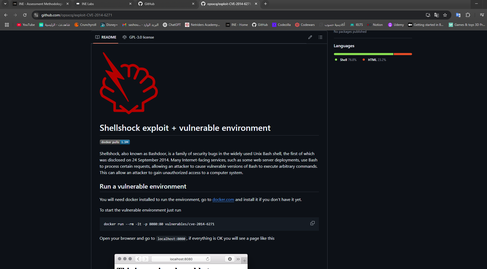

---

## 🧰 Step 6: Configure FoxyProxy and Burp

We use FoxyProxy to intercept traffic in Burp Suite.

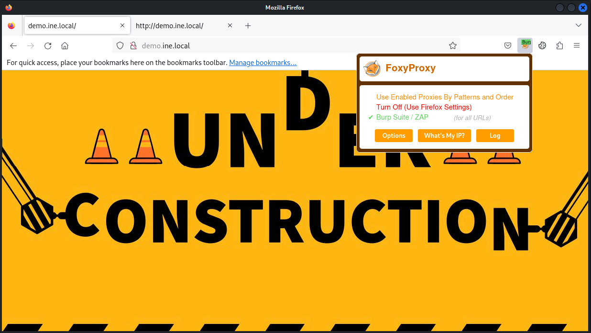

---

## 🕵️‍♂️ Step 7: Capture CGI Request in Burp

We intercept the request to `/gettime.cgi`.

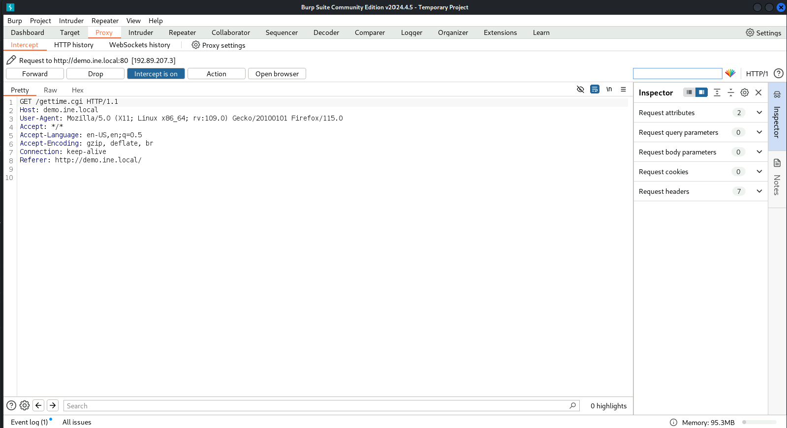

---

## ➕ Step 8: Send to Repeater

Forward the request to Repeater for payload injection.

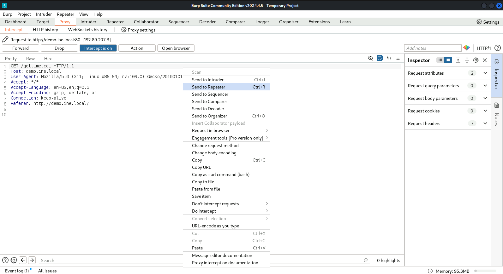

---

## ⚔️ Step 9: Inject Shellshock Payload

Execute remote command to read `/etc/passwd` using:

```
User-Agent: () { :; }; echo; /bin/bash -c 'cat /etc/passwd'
```

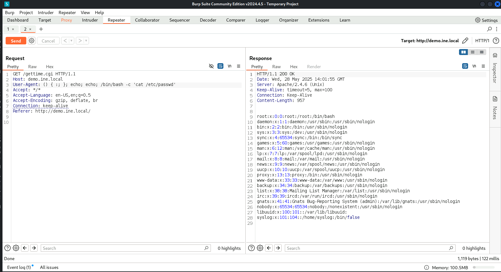

Command output is returned, confirming code execution.

---

## 📃 Step 10: Execute 'id'

We execute the `id` command to confirm user context.

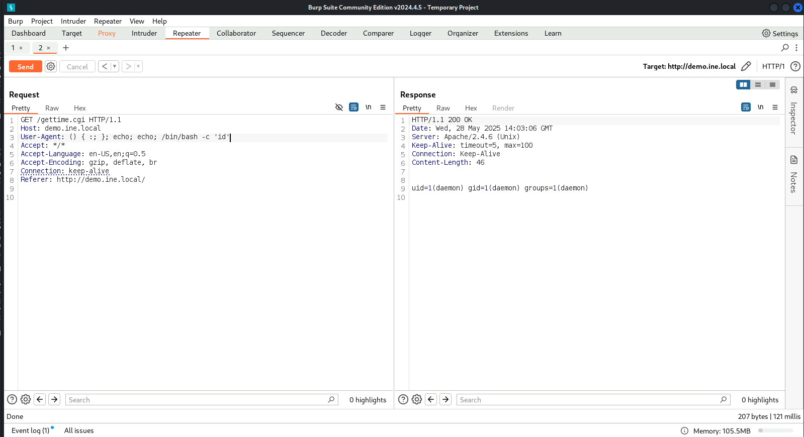

---

## 📊 Step 11: Run 'ps -ef'

Run `ps -ef` to see running processes.

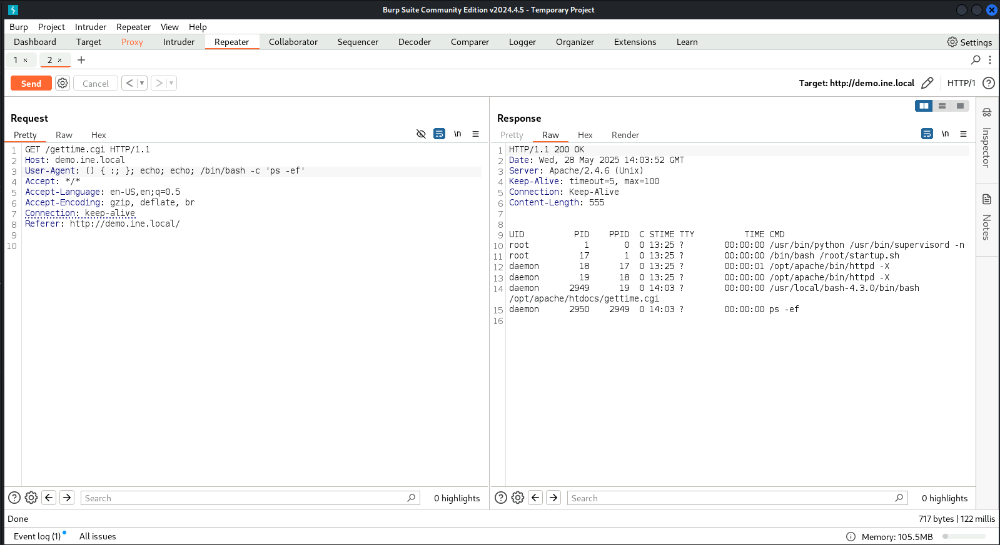

This confirms root process context and demonstrates full RCE.

---

## 📆 Summary

By discovering an exposed CGI file and running the Shellshock exploit, we achieved:

* Remote Command Execution (RCE)
* System reconnaissance

This lab demonstrates how legacy bugs can still pose serious threats.

---

## 📃 Notes

* Exploit: Shellshock (CVE-2014-6271)
* Lab used: eJPT Vulnerability Assessment
* Tools: Nmap, Firefox, Burp Suite

---

**Disclaimer:**
All steps were performed in an authorized CTF lab provided by INE. This walkthrough is for educational purposes only.

---

🔗 **[Back to Main Repository](https://github.com/sara5521/eJPT-CTF-Challenges)**
